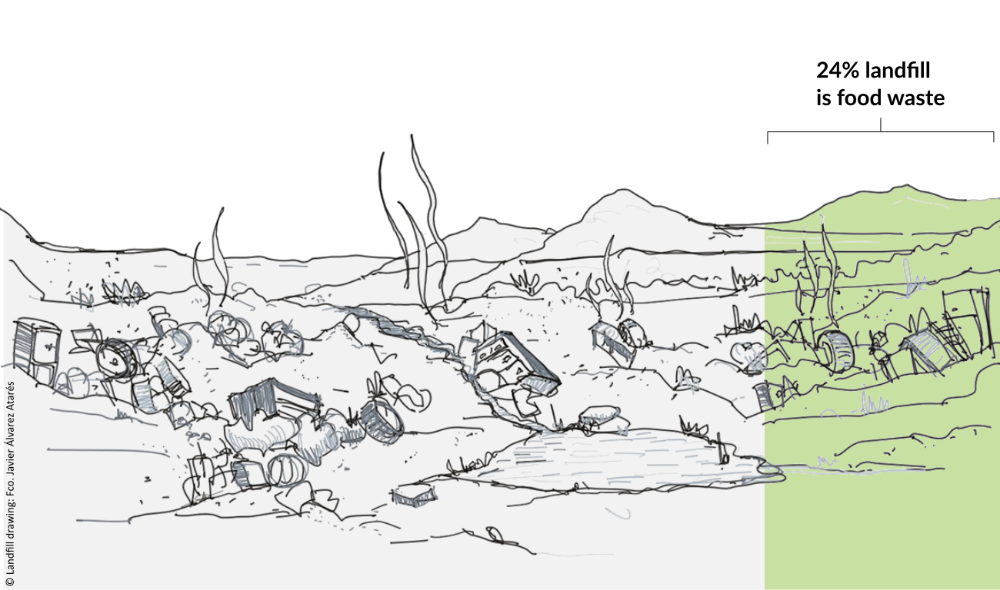
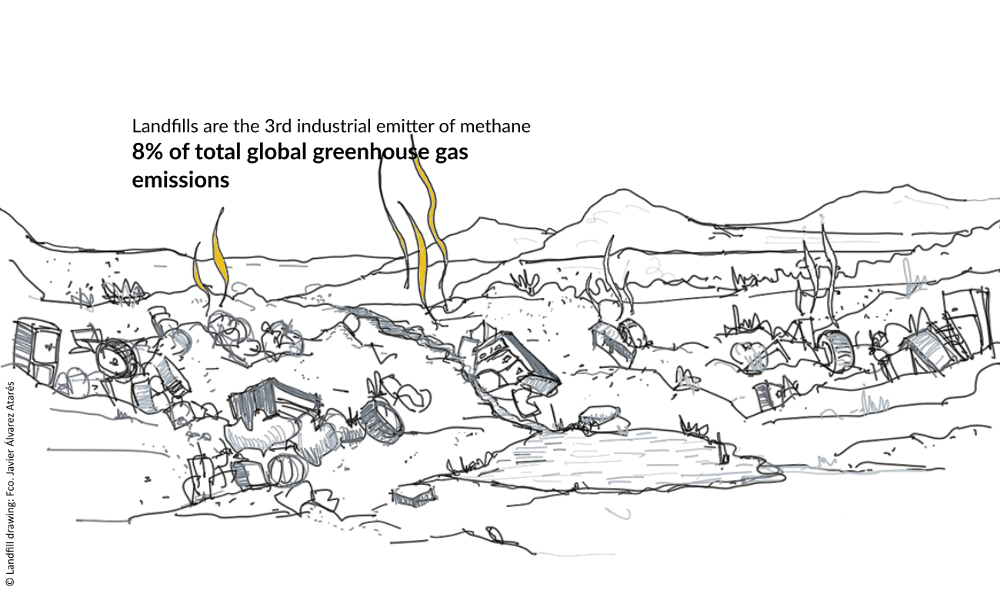
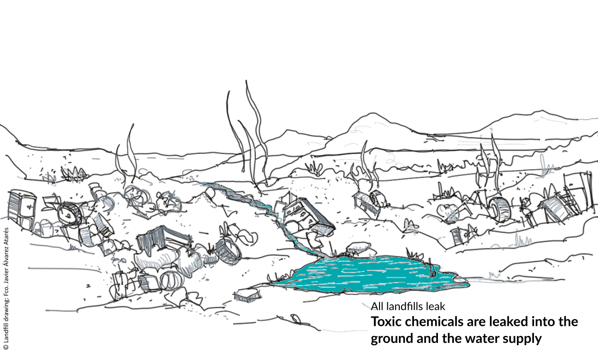

```{css, echo=FALSE}
.level1 {
  min-height: 400px;
  # border: 1px solid;
  margin-bottom: 4em;
  padding: 1em 2em 2em;
  opacity: .2;
}
.exhibit {
  border: none;
}

.sidebar {
  # max-width: 45rem;
  max-width: 30%
}

.sidebar img,
.sidebar embed {
  display: none;
}

.is-active {
  opacity: 1;
  # background-color: lightgreen;
}
p {
  font-size: 1.4em;
}
body {
  margin-bottom: 80vh;
}

.notitle h1 {
  display: none;
}

.header {
  background-image: linear-gradient(rgba(255,255,255,0.5), rgba(255,255,255,0.5)), url("http://www.biocycle.net/wp-content/uploads/2013/01/47.jpg");
  min-height: 600px;
  background-position: bottom center;
  text-shadow: #fff 1px 0 10px; 
}

.title {
  font-weight: 900;
  padding-top: 200px;
}

```

```{r setup, include=FALSE}
knitr::opts_chunk$set(echo = FALSE)

library(wfenexus)
library(emojifont)
library(ggwaffle)
library(extrafont)
library(treemapify)
# library(hrbrthemes)

# Variables ---------------------------------------------------------------


# Colours
color_food <- "#95C448"
color_water <- "#00A9AE"
color_energy <- "#EBC11F"

color_background <- "#34767A"

color_wfp_blue <- "#65C6F0"
color_wfp_green <- "#A2D729"
color_wfp_grey <- "#8f8f98"

# Weight (tonnes) of a Truck.
eq_truck <- 28 

# Import fonts
# font_import(path = here::here("inst/fonts/Roboto_Condensed/"))
extrafont::loadfonts(device="win")

```

# Introduction {#intro}

Some explanation here about the context about food waste, and parts
involved...

Probably combine it with the next section.

<!--  -->

<!--  -->

# Municipal Solid Waste

Municipal Solid Waste (MSW) ---more commonly known as trash or
garbage--- "consists of everyday items we use and then throw away, such
as product packaging, grass clippings, furniture, clothing, bottles,
food scraps, newspapers, appliances, paint, and batteries. This comes
from our homes, schools, hospitals, and businesses." (Source: [EPA](https://archive.epa.gov/epawaste/nonhaz/municipal/web/html/index.html))

Every year, **the US produces a total of 292.4 million tons of Municipal Solid Waste**, 732,614 tons of which are produced in Delaware alone.

This equates to `r scales::number(292.4*10^6/eq_truck, big.mark = ",")` heavy tonnage trucks per year in the case of the US, and to `r scales::number(732614/eq_truck, big.mark = ",")` for Delaware.


```{r eval=FALSE, include=FALSE}

msw <- tibble(
  variable = rep(c("U.S", "Delaware"), times = c(292.4, 0.732))
) %>%
  # Converts to waffle data. waffle_iron() can control number of rows and cols.
  waffle_iron(aes_d(group = variable)) %>%
  mutate(label = fontawesome("fa-truck"))

subtitle_string <- "Every year, <b>the US produces a total of 292.4 million tons of Municipal Solid Waste<b>, 732,614 tons of which are produced in Delaware alone."

gg_waste <- ggplot(msw, aes(x, y, colour = group)) +
  geom_text(aes(label=label), family='fontawesome-webfont', size=8) +
  labs(title= "Municipal Solid Waste",
       subtitle= str_wrap(subtitle_string, 100),
       x = "", y = "",
       color = "",
       caption = "") +
  coord_equal() +
  scale_colour_manual(
    values = c(color_food, "red")
  ) +
  # scale_colour_waffle() +
  # theme_void()
  # guides(shape = "none") +
  theme_waffle() +
  theme(legend.position = "bottom") 

gg_waste

```


# Break {#break class="notitle"}

## Food waste in MSW

In both cases, **food waste accounts for a 21% of the total of MSW**.
While most of wasted food comes from commercial or industrial uses,
residential food waste is significant. 

This means that there is much that can be done at individual level.

```{r}

msw_origin <- tibble(
  location = c("U.S.", "U.S.", "Delaware", "Delaware"),
  value = c(39.53, 60.47, 45.7, 54.3),
  variable = c(rep(c("Residential", "Commercial/institutional"), 2))
) %>% 
  mutate(label = paste0(variable, "\n(", value, "%)"))


ggplot(msw_origin, aes(area = value, fill = variable, label = label)) +
  geom_treemap(show.legend  = FALSE) +
  geom_treemap_text(colour = "white", place = "left",
                grow = TRUE) +
  facet_grid(. ~ location) +
  labs(
    title = "Source of food waste in MSW",
    subtitle = "Foodwaste from residential uses is significant. There is much we can do at individual level.",
    fill = "",
    caption = "Source: ReFED, Insights Engine Glossary, p.2"
  ) +
  scale_fill_brewer(palette = "Paired") +
  theme_minimal() +
  theme(legend.position = "bottom",
        legend.direction="horizontal") 

```

```{r eval=FALSE, include=FALSE}
knitr::kable(head(cars))
```

# Individual contribution (average)

**Surplus food** is *"All **food that goes unsold or unused by a business or
that goes uneaten at home** -- including food and inedible parts (e.g.,
peels, pits, bones) that are donated, fed to animals, repurposed to
produce other products, composted, anaerobically digested, or wasted."*
([ReFED, Insights Engine Glossary,
p.1](https://insights.refed.com/uploads/documents/refed-insights-engine-glossary-vfinal-2021.2.2.pdf?_cchid=7d0e044d61127907795816d134af4e67)).


<embed src="img/individual_contributions.svg" type="image/svg+xml" style="max-width:100%"/>


# Surplus food

Surplus food is *"All **food that goes unsold or unused by a business or
that goes uneaten at home** -- including food and inedible parts (e.g.,
peels, pits, bones) that are donated, fed to animals, repurposed to
produce other products, composted, anaerobically digested, or wasted."*
([ReFED, Insights Engine Glossary,
p.1](https://insights.refed.com/uploads/documents/refed-insights-engine-glossary-vfinal-2021.2.2.pdf?_cchid=7d0e044d61127907795816d134af4e67)).

On the consumer level, **individuals in the U.S. throw out nearly 25% of
the food they bring into their homes**. This amounts to a whopping 20
pounds of edible food wasted every single month

```{r food_waste_consumer}

waffle_data <- tibble(
  variable = rep(c("wasted Food", "Not wasted"), times = c(35, 65))
) %>%
  # Converts to waffle data. waffle_iron() can control number of rows and cols.
  waffle_iron(aes_d(group = variable)) %>%
  mutate(label = fontawesome("fa-shopping-basket"))

subtitle_string <- "On the consumer level, individuals in the U.S. throw out nearly 25% of the food they bring into their homes. This amounts to a whopping 20 pounds of edible food wasted every single month"

gg_waste_consumer <- ggplot(waffle_data, aes(x, y, colour = group)) +
  geom_text(aes(label=label), family='fontawesome-webfont', size=8) +
  labs(title= "Food waste per household",
       subtitle= str_wrap(subtitle_string, 100),
       x = "", y = "",
       color = "",
       caption = "Data Source: Dailycal.org") +
  coord_equal() +
  scale_colour_manual(
    values = c(color_food, "red")
  ) +
  # scale_colour_waffle() +
  # theme_void()
  # guides(shape = "none") +
  theme_waffle() +
  theme(legend.position = "bottom") 

gg_waste_consumer
```


# Food waste equivalences

While at first sight, this might seem neglibile at an individual level,
figures per household and nationwide tell us otherwise: **The costs of
food waste are very high in terms of money and weight**

<embed src="img/food_waste_equivalences.svg" type="image/svg+xml" style="max-width:100%"/>


# Environmental impacts of food waste

Food waste has considerable impacts on the environment in terms of
carbon and water footprint.

**Carbon footprint:** definition and units

**Water footprint:** definition and units

<embed src="img/food_waste_footprint.svg" type="image/svg+xml" style="max-width:100%"/>


# The cost of food waste

The cost of surplus food is estimated at \$398 billion per year, with
70% of that cost paying for waste management.

If we exclude the surplus food generated on the farm and during
manufacturing, the total surplus food produced by consumers,
foodservice, and retail sectors is 53 million tons per year, or 324.6
pounds per person, and costing \$350 billion. The U.S. EPA set a goal of
reducing food waste disposed by 50% by 2030. Using a 2010 baseline
estimate of 219 pounds per person (post-processing), that means a goal
of disposing 109 pounds per person. The U.S. is far from reaching its
2030 food waste goal.


# How is surplus food managed?

There are three different primary management pathways for surplus food:

1.  **Donated** to food banks or otherwise "rescued"
2.  **Recycled** such as through composting, feed for animals, anaerobic
    digestion, or industrial use
3.  **Wasted** food is "Uneaten food and inedible parts that end up
    being landfilled, incinerated, disposed of down the sewer, dumped,
    spread onto land, or simply not harvested." (ReFED, Insights Engine
    Glossary, p.2)

```{r spf_management}
spf_management <- tibble(
  location = c("U.S", "U.S", "U.S", "Delaware", "Delaware"),
  value = c(2.8, 54.1, 17.07, 0.15, 0.0525),
  variable = c("Donated", "Wasted", "Recycled", "Wasted", "Other")
) %>% 
  mutate(label = paste0(variable, "\n(", value, " million tones)"),
         group = variable)


ggplot(spf_management, aes(area = value, fill = variable, label = label)) +
  geom_treemap(show.legend  = FALSE) +
  geom_treemap_text(colour = "white", place = "left",
                grow = TRUE) +
  facet_grid(. ~ location) +
  labs(
    title = "Surplus Food management",
    subtitle = "Some subtitle here",
    note = "Source: ReFED, Insights Engine Glossary, p.2"
  ) +
  scale_fill_brewer(palette = "Paired") +
  theme_minimal()

```

# Where is wasted food going to?

More than half of the food waste goes to Landfills. A notable difference
from Delaware is that food is the lack of incineration.

```{r}
wasted_food <- tibble(
  location = c("U.S.", "U.S.", "U.S.", "U.S.", "U.S.", "U.S.", "Delaware", 
               "Delaware", "Delaware", "Delaware", "Delaware"),
  value = c(50.9, 25.6, 9, 6.7, 6.7, 1.1, 65.6, 22.5, 10.7, 0.29, 0.88),
  variable = c("Landfills", "Not harvested", "Sewer", "Land application", 
               "Incineration", "Dumpings",
               "Landfills", "Not harvested", "Sewer", "Land application", 
               "Dumpings"),
  group = "Wasted"
) %>% 
  mutate(label = paste0(variable, "\n(", value, "%)"))


ggplot(wasted_food, aes(area = value, fill = variable, label = label)) +
  geom_treemap(show.legend  = TRUE) +
  geom_treemap_text(colour = "white", place = "left",
                grow = TRUE) +
  facet_grid(. ~ location) +
  labs(
    title = "Destination of Food Waste",
    subtitle = "More than half of food waste goes to food waste, in the U.S. and Delaware.",
    fill = "",
    caption = "Source: ReFED, Insights Engine Glossary, p.2"
  ) +
  guides(fill = guide_legend(nrow = 1)) +
  scale_fill_brewer(palette = "Paired") +
  theme_minimal() +
  theme(legend.position = "bottom",
        legend.direction="horizontal") 

```

# How is surplus food managed? (Another option)

NOTE: This is a combination of the two previous slides. I particularly think this one is better.

There are three different primary management pathways for surplus food:

1.  **Donated** to food banks or otherwise "rescued"
2.  **Recycled** such as through composting, feed for animals, anaerobic
    digestion, or industrial use
3.  **Wasted** food is "Uneaten food and inedible parts that end up
    being landfilled, incinerated, disposed of down the sewer, dumped,
    spread onto land, or simply not harvested." (Source: [ReFED, Insights Engine
    Glossary, p.2](https://insights.refed.com/uploads/documents/refed-insights-engine-glossary-vfinal-2021.2.2.pdf?_cchid=7d0e044d61127907795816d134af4e67))


```{r}
spf_management_combined <- read_csv("data/surplus_waste_distribution_tier2.csv",
                                    col_types = list(
                                      location = col_factor(),
                                      treatment = col_factor(),
                                      parent = col_factor()
                                    )) %>% 
  mutate(label = paste0(round(million_tonnes, 2), 
                        " million tonnes \n(", percentage *100, 
                        "%)")) %>% 
  mutate(parent2 = ifelse(is.na(parent), "Not wasted", "Wasted")) %>% 
  filter(treatment != "Wasted")


ggplot(spf_management_combined, aes(area = million_tonnes, fill = treatment, label = label,
                        subgroup = parent2)) +
  geom_treemap(show.legend  = TRUE) +
  geom_treemap_text(colour = "white", place = "left", grow = TRUE) +
  geom_treemap_subgroup_border() +
  geom_treemap_subgroup_text(place = "bottomleft", grow = TRUE , alpha = 0.5, 
                             colour = "black", fontface = "italic", 
                             min.size = 0) +
  facet_grid(. ~ location) +
  labs(
    title = "Destination of Food Waste",
    subtitle = "More than half of food waste goes to food waste, in the U.S. and Delaware.",
    fill = "",
    caption = "Source: ReFED, Insights Engine Glossary, p.2"
  ) +
  guides(fill = guide_legend(nrow = 2)) +
  scale_fill_brewer(palette = "Paired") +
  theme_minimal() +
  theme(legend.position = "bottom",
        legend.direction="horizontal") 

```

# Food in landfills

Food waste is the number one material in American landfills, accounting
for 24.1 percent of all municipal solid waste (MSW), [according to the
EPA](https://www.epa.gov/facts-and-figures-about-materials-waste-and-recycling/food-material-specific-data).

MSW, in turn, accounts for a `21.6%` (63.13 million tons) of landfills
in the US and 21.06% (154,255 tons) for Delaware.



# Landfill and Emissions

As food rots in a landfill, it emits ***methane*****, a greenhouse gas
28 to 36 times more potent than the carbon** that comes out of passenger
vehicles and accelerates climate change. The greenhouse gases that
result from food waste produce the equivalent amount of 37 million cars

**Landfills are the third-largest industrial emitter of methane**, with
food waste alone representing 8 percent of total global greenhouse gas
(GHG) emissions. (Source:
[Rubincon](https://www.rubicon.com/blog/food-waste-facts/)).

In 2007, the global carbon footprint, excluding land-use change, of food
waste has been estimated at 3.3 Gtonnes of CO2 eq. This amount is more
than twice the total GHG emissions of all USA road transportation in
2010 (Source: [FAO](http://www.fao.org/3/i3347e/i3347e.pdf)).



# Landfills and leaks

All landfills leak -- some over time and some from day one of operation
-- leaching toxic chemicals into the ground and the water supply
([source](https://www.clf.org/blog/all-landfills-leak-and-our-health-and-environment-pay-the-toxic-price/))



# Landfills: wrap-up

While it is possible to offset the harm derived from foodwaste in
landfills through organics recycling, composting, and anaerobic
digestion, **the best way to reduce these emissions and leaks is to
waste less food in the first place**.

<embed src="img/landfill.svg" type="image/svg+xml" style="max-width:100%"/>


# Alternative scenarios

What can we do as consumers to reduce food waste and its impacts?

# Increased use of in-sink grinders - i.e., garbage disposals:


These products grind up food waste on-site, and when combined with running water, is disposed down the sewer drain for treatment at the wastewater treatment plant. This option can be useful where areas have excess wastewater treatment capacity, as is the case in Wilmington, DE.

* [A pilot study in Philadelphia](https://www.waste360.com/food-waste/philadelphia-aims-food-waste-sink-disposal-law) found that household food waste sent to the landfill dropped 35% after targeted use of grinders.
* Limitation: grinders should not be used with all food wastes- i.e., high fat animal products - meat, dairy; some vegetable products like onion skins and potato peels.
* If the grinder waste is used with co-digestion at the wastewater treatment plant: ReFed estimates that **this pathway could divert 8,130 tons of food waste in Delaware** with a net financial benefit of $189,000 and a savings of 2,750 metric tons CO2e each year. **No water savings are expected from this option**. 

# Switching to meal kits:

In this instance, the consumer purchases pre-packaged meal kits that have precise quantities of products needed to prepare meals, avoiding excess food that may spoil. Grocery retailers and other businesses are increasingly marketing meal kits, expanding consumer choice. 

⇒ Expansion of this pathway could **divert 5,600 tons of food waste in Delaware** with a net financial benefit of **$21 million and a savings of 25,400 metric tons CO2e and 1.25 billion gallons of water each year**. 


# Home composting:

This option is commonly promoted as a way for households to reduce the food waste headed to the landfill and to produce a usable by-product (compost). As with in-site grinders, not all materials are appropriate for composting (i.e., meats and seafood can generate odors and attract wildlife). Additionally, food waste should be mixed with other organic materials such as paper, cardboard, or yard trimmings, to ensure the proper mix for complete biological breakdown of the waste.

⇒ Expansion of this option throughout the state could divert 297 tons of food waste from the landfill, with a net financial benefit of $15,500 and a savings of 147 metric tons of CO2e each year. No water savings are expected.


[the best option statewide to reduce food waste in tonnage and savings ($, energy, water) is to reduce portion sizes in restaurants, institutions, grocery stores, etc. -- but consumers are passive in those decisions]

